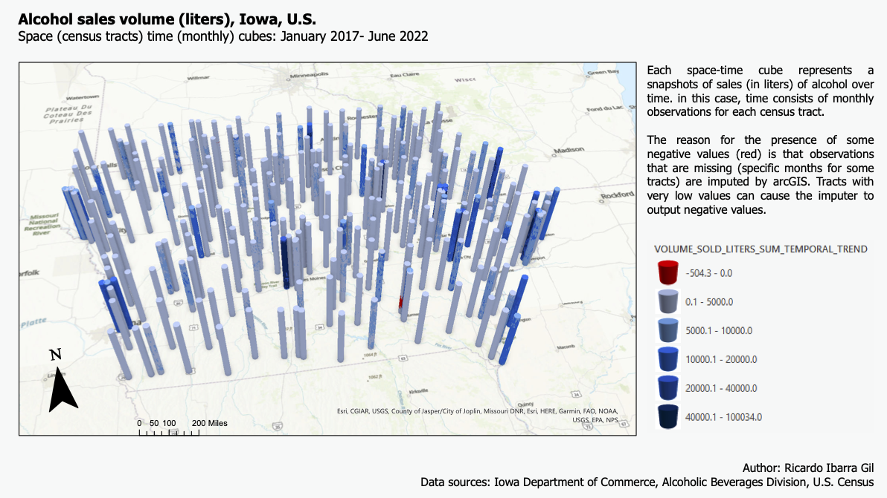

<html>
<head>

</head>
<body>

<h1> Final project </h1>

<h1> Section 1. Descriptive analytics </h1>
<!-- What is the overall trend in sales over the past years? 
Are there any patterns?  -->
 

Alcohol sales and consumption are two components of Iowa's social and economic landscape. Not only does Iowa produces corn for industrial ethanol (4.5 billion gallons in 2022, contributing with over 25% to total U.S. ethanol production of ~17.5 billion gallons). But it is also home to many breweries, distilleries and wineries that produce alcohol for human consumption. This analysis focuses on the latter, but does not include beer and wine. 

In Iowa, people spent around 771 million dollars per year in alcoholic beverages last year, this is, approximately 593.3 dollars per household. Iowa is the 37th state in terms of spending on alcoholic beverages.  

On the tax side of this story (there is always a tax side), Iowa's state and local tax revenues from alcohol generated -in 2022- "an all-time record of $150.1 million, an increase of $284,106 over the previous fiscal year. The sales growth generated record liquor net profits of $120.6 million, which will be used to support essential state programs and services.", according to the Alcoholic Beverages Division. However, when compared to the rest of the country, Iowa ranks 5 places lower than in consumption, in 42th place. 
 
<iframe src="https://insights.arcgis.com/#/embed/4b198e5dff234c64a253568b122888d0" width=1050 height=1480 frameborder="0"></iframe>

 
Over time, Iowans have spent slightly more during recent months in alcohol. Both sales is dollars and in liters of alcohol show a somwehat increasing trend. 
 
<iframe src="https://insights.arcgis.com/#/embed/824adf10c1d740489e49f1c1e68040cc" width=1000  height=1020 frameborder="0"></iframe>
 

Sales of domestic vodka and whisky are the main beverages consumed in the state.
 
<iframe class="center" src="https://insights.arcgis.com/#/embed/99f95e04cd9e4f1290ab788fafbb31c7" width=460 height=540 frameborder="0"></iframe>
 
Focusing on sales of alcohol over the state of Iowa, the follwowing raph shows that yearly sales follow a normal seasonal pattern, with annual increases in sales during June and December. 
 

If analyzed by county, volume sold concentrates in urban areas, specifically in counties with cities. Des Moines in Polk county, Cedar rapids in Linn county, Waterloo, Davenport and Iowa City in Black Hawk county, Scott county and Johnson county, accordingly. While there are adjustments to be made to some of the variable -and that are adressed in the analysis that follows-, the graphs and maps shown provide a good idea of what, when, how much and where do Iowans consume alcohol. 

<iframe src="https://insights.arcgis.com/#/embed/b4b6f275a2a444d1990493ddac181c71" width=700  height=650 frameborder="0"></iframe>

<h1> Section2. Geo spatial descriptive analysis </h1>
<!-- Which stores have the highest and lowest sales?
Is there a geographical pattern in the data?
Are there any clusters or hotspots of high/low sales?
What factors are contributing to these hot/cold spots? -->
<!-- Is there any relationship with CDC’s Alcohol dependency data?
Is there any relationship with other health metrics? -->

Another piece of information related to alcohol consumption has to do with health indicators. Spcieficially, with CDC's excess fdrinking (defined as...) and fatalities caused by driving accidents due to alcohol impairement. In this regard, it is a bit surprising to note that....

<iframe src="https://insights.arcgis.com/#/embed/ca30101f56f042ffaf90a8f38e407b6f" width=820 height=1080 frameborder="0"></iframe>

Next, arcGIS was used to create a more refined analysis. For starters, the following graph focuses on data from alcohol stores in Iowa, it displays the amount of liters sold over the numeber of people over 21 years old who live in an area of 4 miles arlund the store. that When focused on the volume of alcohol sold per person over 21 years old. 

 

### Comments here

<!-- <h1> Descriptive analytics: graphs from ArcGIS Pro </h1> -->
There is some trend in the consumption of alcohol. The middle and the end of the year usually have higher rates of consumption.

<!-- Grafica de barras -->

Graphs the volume of alcohol sold each month in Iowa during the past 5.5 years.No data for july-Dec 2022

<!-- Grafica como de dona -->

<h1> Section 3. Space time cubes and predictions </h1>
Is it possible to predict future sales of alcohol using ?
What factors should we consider to predict it?
What factors turn out to be the most relevant for the predictions?

<h2> Section 1. Descriptive analytics </h2>
Alcohol sales in Iowa ...
he data consists of ...

# MENCINOAR ALGO

Link to this site: <a href = "https://ribarragi.github.io/GIS_portfolio/Final_project_report.html" > link </a>

Sources:

Tax revenues: Tax Policy Center (Urban Institute & Brookings Institution) https://www.taxpolicycenter.org/statistics/state-and-local-alcohol-tax-revenue

Time Series Forecasting: https://www.youtube.com/watch?v=gxoZ-vWUlh4

Space time cube creation: https://www.youtube.com/watch?v=1lpCJfKbYLg

<h1>DISCLAIMERS</h1>
I wanted to create a story map, but after several attemps, I could not load scenes into my ArcGIS online account.

The main overall objective of this project was to explore and <b>EXPLOT?</b> the funcitonalities of time cubes for temporal data in ArcGIS

# Assets

All preprocessing code is contained in the following folder...
All data is available in the follwing drive folder