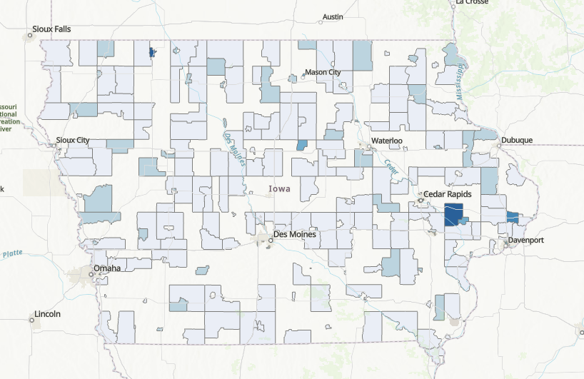

<html>
<head>

</head>
<body>

<h1><b> An Analysis and Forecast of Iowa's Alcohol Sales Implications </b>

 - A report for Iowa’s Alcoholic and Beverages Division - 
</h1>

<h2> Section 1. Descriptive analytics </h2>
<!-- What is the overall trend in sales over the past years? 
Are there any patterns?  -->

Alcohol sales and consumption are two components of Iowa's social and economic landscape. Not only does Iowa produces corn for industrial ethanol (4.5 billion gallons in 2022, contributing with over 25% to total U.S. ethanol production of ~17.5 billion gallons). But it is also home to many breweries, distilleries and wineries that produce alcohol for human consumption. This analysis focuses on the latter, but does not include beer and wine. 
 
In Iowa, people spent around 771 million dollars per year in alcoholic beverages last year, this is, approximately 593.3 dollars per household. Iowa is the 37th state in terms of spending on alcoholic beverages.  
 
On the tax side of this story, Iowa's state and local tax revenues from alcohol generated -in 2022- "an all-time record of $150.1 million, an increase of $284,106 over the previous fiscal year. The sales growth generated record liquor net profits of $120.6 million, which will be used to support essential state programs and services", according to the Alcoholic Beverages Division. However, when compared to the rest of the country, Iowa ranks 5 places lower than in consumption, in 42th place. 
 
<iframe src="https://insights.arcgis.com/#/embed/4b198e5dff234c64a253568b122888d0" width=1050 height=1480 frameborder="0"></iframe>
 
 

Over time, although total alcohol sales (in USD) show a substantially increasing trend, if we look at sales over time in liters, then the upward trend is not so evident. A potential explanation for this mismatch could be inflationary: as prices continue to go up, the total ticket for the same amount of alcohol goes up. Data then shows a modest increase in alcohol consumption in the state.
 
 

<iframe src="https://insights.arcgis.com/#/embed/824adf10c1d740489e49f1c1e68040cc" width=1000  height=1020 frameborder="0"></iframe>
 
 

When looking into the categories of alcohol that Iowans prefer, the top 2 products sold are domestic vodka and domestic whisky, wth combined sales of over 56 million dollars. 
 

 

<iframe src="https://insights.arcgis.com/#/embed/99f95e04cd9e4f1290ab788fafbb31c7" width=460 height=540 frameborder="0"></iframe>

 
Focusing on sales of alcohol over the state of Iowa, the follwowing raph shows that yearly sales follow a normal seasonal pattern, with annual increases in sales during June and December. Perhps this pattern is better shown in the clock date graph that contains the volume of alcohol sold each month in Iowa during the past 5.5 years by month (there is no data for july-Dec 2022):
 
 

If analyzed by county, volume sold concentrates in urban areas, specifically in counties with cities. Des Moines in Polk county, Cedar rapids in Linn county, Waterloo, Davenport and Iowa City in Black Hawk county, Scott county and Johnson county, accordingly. While there are adjustments to be made to some of the variable -and that are adressed in the analysis that follows-, the graphs and maps shown provide a good idea of what, when, how much and where do Iowans consume alcohol. 
 
 

<iframe src="https://insights.arcgis.com/#/embed/b4b6f275a2a444d1990493ddac181c71" width=700  height=650 frameborder="0"></iframe>

<h2> Section 2. Geo spatial descriptive analysis </h2>
<!-- Which stores have the highest and lowest sales?
Is there a geographical pattern in the data?
Are there any clusters or hotspots of high/low sales?
What factors are contributing to these hot/cold spots? -->
<!-- Is there any relationship with CDC’s Alcohol dependency data?
Is there any relationship with other health metrics? -->

A first approach to the spatial relationship between alcohol consumption and its effect on health-related variables is shown in the following two maps. Both include a kernel density of the volume of sales in liters. The fisrt map has an underlying choropleth layer with the rate of excess drinking (defined as the sum of binge and heavy drinking) in each county, while the second shows in blue the number of deaths in driving accidents related to alcohol impared driving as a percentage of total deaths in driving accidents. 
 
 

Interestingly enough, some counties with a somewhat high concetration of alcohol sales do not register much excessive drinking (such as Cass and Shelby in the Southwest, or Ottumba and Farifield in the Southeast). 
 
 

Some similar cases appear also in the case of deaths related to impaired driving, in counties such as Waterloo. I think a partial conclusion from this maps could be that we see an expected relationship in most of the cases, but some counties do not exhibit such patterns.
 
 

<iframe src="https://insights.arcgis.com/#/embed/ca30101f56f042ffaf90a8f38e407b6f" width=820 height=1080 frameborder="0"></iframe>

 

Next, arcGIS was used to create a more refined analysis. For starters, the variable consumption over population was created. This variable takes the amount of liters sold and divides it by the number of people over 21 years old, who live in an area of 4 miles around the store. This data is available for every store selling alcohol in Iowa.
 
 

The next graph shows that the average consumption of alcohol lies around 1.6-1.7 liters per month, and appears to have a pretty stable pattern over the last six years.
 
 

 

This graph now compares the proportion of deaths due to impaired driving with the volume sold per capit per county. It is surprising not to find a stronger a clearer positive relationship between both variables. 
 
 

 
 

Lastly, the pairwise correlations between the consumption and the health variables confirms this surprisingly weak positive relationship: excessive drinking and deaths have even a slightly negative relationship with volume consumed per capita. A positive correlation is oserved between the total number of deaths by impaired driving and the volume consumed per capita.
 
 

 

<h2> Section 3. Space time cubes and predictions </h2>
<!-- Is it possible to predict future sales of alcohol using ?
What factors should we consider to predict it?
What factors turn out to be the most relevant for the predictions? -->
We now enter the space time analysis of the sales and health data. One of the main reasons of this project was to gain experience on the creation and analysis of space time cubes; in this case, those were built for alcohol sales first at the census tract level. 
 

Each cube contains layers, each layer represents an observation in a point in time, so piling up all the layers results in a variable over time. In this case, each layer represents a month. The following two layouts show the space time cubes for all the sales data at the census tract level. 
As explained in the layout, some observarions are red (negative) because missing observations (no entries for a specific month for a specific number of stores in one tract) is imputed using the neighboring (in time) data. The first graph (in green) shows cubes for alcohol sales normalized by population and the second one (blue) shows alcohol sales in liters.

 
 

 
 
Then, both set of cubes were used to forecast the sales of alcohol by census tract for the next 12 months (from July 2022 to August 2023). However, the results were not satisfactory, as many of the observations (approx. 25%) were lost due to a mismatch from the sales data with the census tracts.

The resulting forecasts (displayed next) have many missing tracts, some of them of great relevance, such as the one in the proximity of Des Moines, or Waterloo.

 

After these somewaht discouraging results, I decided to do it at the county level. While this implies losing detail on the data, it would allow me to have a complete forecast to evaluate.
The same space time cubes were built: one for alcohol sales per capita and one for total volume sold, but now aggregated at the county level.
 
 

 

 
 

With these new cubes, the following gif shows the resulting forecast for the next 12 months after the last observation (July 2022 to August 2023):

 
 

The first months after the final datapoint, it seem like the model outputs very low values at first, and then very high. But after a couple of months, the forecast seems more reasonable, expcet for the fact tha many of the counties get a negative forecast (a non allowed value for this variable).
 

<h2>Report conclusions</h2>

1. A weaker than expected relationship betwen the health related metrics (excessive drinking and deaths by alcohol impaired driving, both relative and total) and alcohol sales in the state of Iowa was found.
 

2. The weak relationship could be explained by multiple factors and an indepth analysis would is advisable. Potential explanations include: data limiations (specifically, more granular data for health indicators, and ideally more frequent (monthly)); data on alcohol consumption, not only alcohol sales; other indicators of potential effects of alcohol could help to validate the alcohol consumption data (domestic violence, hepathic diseases, among others)
 

3. While the forecasts have limitations, it would be worth exploring other forecasting tools that also rely on the space time structures created to potentially get better results.
 

4. State and local tax authorities may be interested in studying the optimal alcohol tax rate, as there may be space for increasing it without imapcting demand.

<h2>Personal Conclusions</h2>

- The learning curve understinding how time space cubes work, how to preprocess and arrange the data and how to create them was a bit steeper than expected. But the concepts are really interesting, and there are plenty of other tools that use subes as input.
 

- I also spent a great deal of time arranging the data to bring it into arcGIS. The original sales data contained over 40 million observations. I had to reduced that, losing some detail in the data, but gaining processing time once it was brought into arcGIS.
 

- I thought it would be easier to intertwine arcGIS Insights and arcGIS Pro, but in the end I couldnt figure out how to share data between them, so Itreated them as separate components of the project.
 

- I think I lost a bit of the narrative and structure of the project due to the time spent in preprocessing, learning the tools and trying to combine Insights and arcGISPro, and when I didnt find a strong relationship between alcohol sales and health related indicators. The original idea was to use the forecasts on alcohol sales (at the census tract level and with monthly observations for the past 6 years), determine a strong relationship with the health related variables (only available at the county level and once a year), and estimate the forecast of the health related variables. But I couldnt either get the complete forecast at the census tract level or establish a strong relationship between the variables.
 

- While the forecasts do not seem to be very accurate, the experience of working with space time cubes was rewarding. I got a special interest in trying to use other forecasting tools available that also draw into the architecture of space time cubes. 
 

- Another element that cause problems was that it took me a lot of time to create the cubes at the census tract level, because an input for the creation if the cubes is a unique identifier for each tract, which would normally be the FIPS code, however, this identifier must be numeric (less than 5 digits long), so I had to play with the creation of other columns to make this match possible. I think it was in this process where I lost 25% of the census tracts to generate their timespace cubes.

Link to this site: <a href = "https://ribarragi.github.io/GIS_portfolio/Final_project_report.html" > link </a>

<h2>References and sources</h2>

- Tax revenues data from the Tax Policy Center (Urban Institute & Brookings Institution) --> <a href="https://www.taxpolicycenter.org/statistics/state-and-local-alcohol-tax-revenue">here</a> 
- Health related data at the county level, from CountyHealthRankings --> <a href="https://www.countyhealthrankings.org/explore-health-rankings/rankings-data-documentation">here</a> 
- Time Series Forecasting (<a href="https://www.youtube.com/watch?v=gxoZ-vWUlh4">video</a>)   
- Space time cube creation (<a href="https://www.youtube.com/watch?v=1lpCJfKbYLg">video</a>)   

<h2>Assets</h2>

Preprocessing code:
  - Cleaning and parsing alcohol sales data --> <a href="project_assets/Preprocess_code/Alcohol_data.ipynb">here</a> 
  - Cleaning and parsing alcohol-health data --> <a href="project_assets/Preprocess_code/Data_parsing.ipynb">here</a> 

All data is available in the follwing drive folder --> LINK
Project package --> LINK
