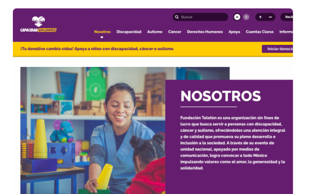
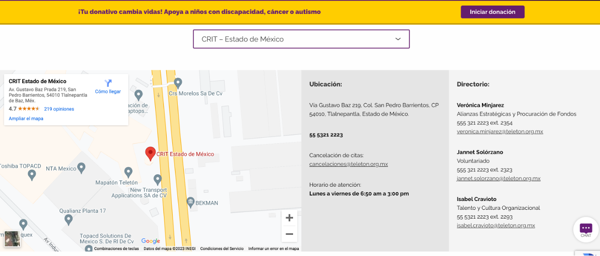
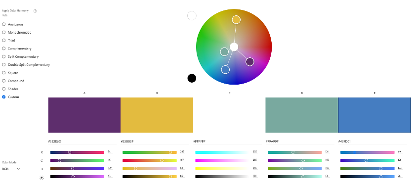
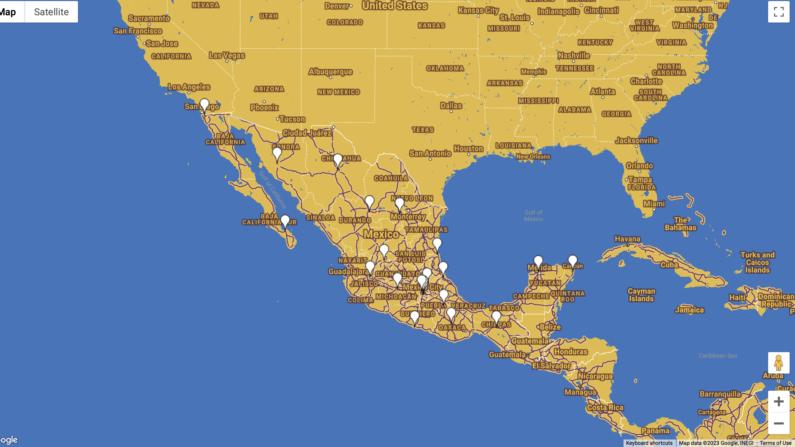
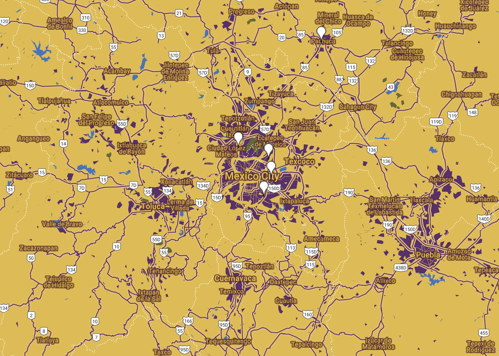
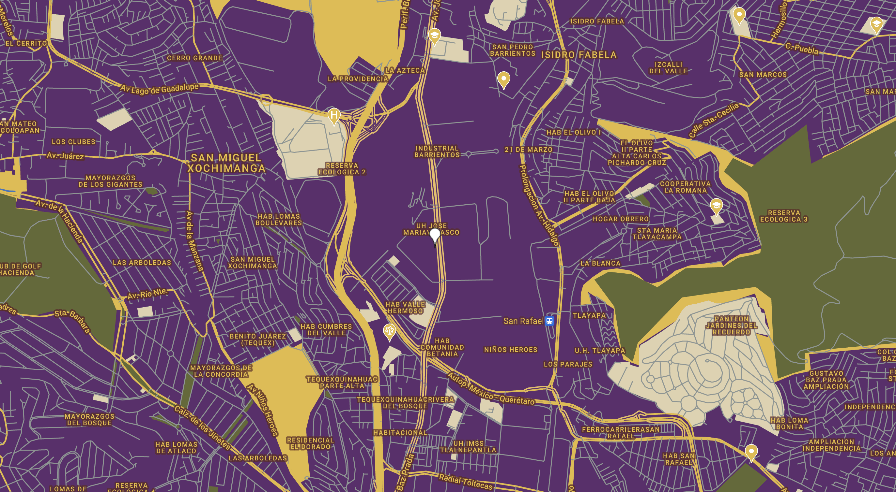
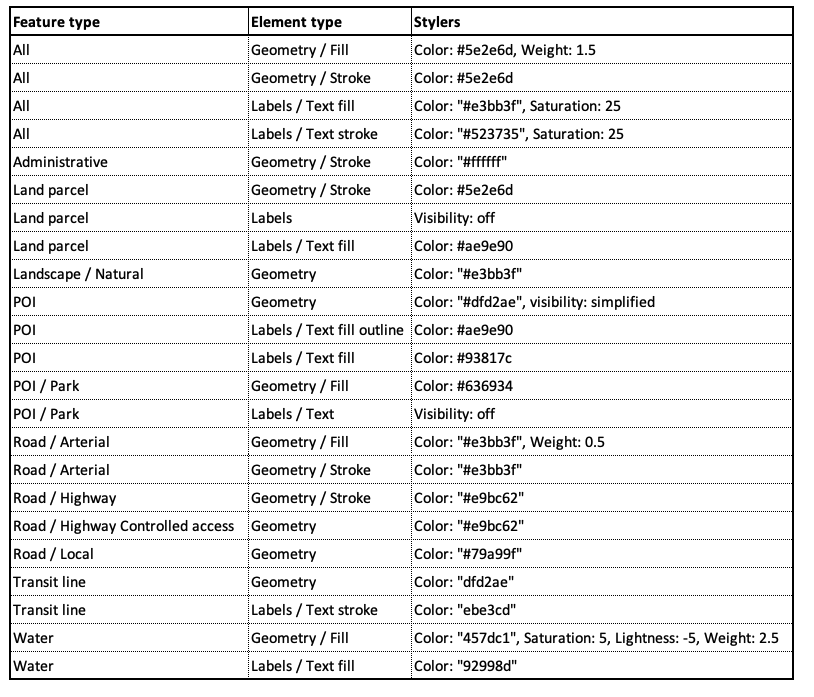

<html>

<body>

<h1>One page bid to design a map for website</h1>

The organization requesting a proposal is <b>Teleton</b>: a Mexican non profit that seeks to help children with disabilities, cancer and autism. It offers quality care and rehabilitation in over then 22 facilities all across Mexico.

 
 
 
 

This is their <a href="https://teleton.org/">website</a> current style,
 

 
 
This is the <b>map they currently use</b> to show the users where their rehablitation centers are:
 
 

 
 

The project includes the <b>following activities and deliverables</b>. The table also includes time and cost estimates:
 
 
<table style="width:100%">
  <tr>
    <th>Date (day)</th>
    <th>Task - description</th>
    <th>Hours/cost estimate</th>
    <th>Hours/cost actual</th>
  </tr>
  <tr>
    <th colspan="4">Phase 1</th>
  </tr>
  <tr>
    <td>Day 1</td>
    <td>Develop a map that matches the overall look and feel of the organization site.  </td>
    <td>2</td>
    <td>1.4</td>
  </tr>
  <tr>
    <td>Day 1</td>
    <td>Create an accessible web page that includes screenshots at three distinct zoom levels using the redesigned base map</td>
    <td>2</td>
    <td>1.2</td>
  </tr>
  <tr>
    <td>Day 1</td>
    <td>Provide a link on the web page to a downloadable JSON file. </td>
    <td>0.5</td>
    <td>0.8</td>
  </tr>
  <tr>
    <td>Day 1</td>
    <td>Create simple instructions documenting the provided materials and how to effectively use them.  </td>
    <td>2</td>
    <td>0.5*</td>
  </tr>
  <tr>
    <th colspan="4">Phase 2</th>
  </tr>
    <tr>
    <td>Day 1</td>
    <td>Develop an interactive map utilizing the Google API.  The map shall be embedded on a demonstration HTML page that the client can access. </td>
    <td>2</td>
    <td>0.8*</td>
  </tr>
  <tr>
    <td>Day 1</td>
    <td>Create and deploy a KML file that shows point locations for client sites (these can be real or hypothetical).</td>
    <td>2</td>
    <td>0.6*</td>
  </tr>
  <tr>
    <td>Day 1</td>
    <td>Ensuring the API and credentials are correctly utilized and secured.  </td>
    <td>2</td>
    <td>0.7*</td>
  </tr>
  <tr>
    <th>Total</th>
    <th></th>
    <th>9.5 ($950)</th>
    <th>6.0 ($600)</th>
  </tr>
</table>
 
Some comments and thoughts about going from the estimates to the actual time of execution:
In all cases I overestimated the time it would take me to complete each of the tasks; however, I do think that the level of depth that I went into each of them may not be the ideal if I were to actually deliver this an NGO. For example, the activities whose actual time have an asteriscs are those that I think I could have spent more time exploring the tools, and creating something more tailored to the client, and making sure that everyithin is set up to work propoerly (for example, the API credentials, I am not 100% sure they are properly setup even though I did secure them, but I would feel more comfortable having spent more time in understanding how they work).

 
 
<h1>Work developed</h1>
 
<h2>Color palette</h2>
Based on the organization image and style, I selected the following color palette to customize their basemap:

 

<h2>Finished Map</h2>
<h3>The following maps shows the 22 centers located all across Mexico</h3>
(Note: I could not make the customized icon work when exporting the kml :(, it kept defaulting to the white drop) 

 
<h3>This is a zoom to the central part of the coutry, where Teleton has four rehabilitation centers</h3>

 
<h3>This is a zoom to Mexico City, specifically to Teleton central office and largest rehabilitation center</h3>

 

<h2>Link to the map</h2>
The map can be accessed and 
https://ribarragi.github.io/GIS_portfolio/google_map_style_teleton.html
 
 
<h2>Lookup table</h2>
The following lookup table summarizes the styles used for the basemap:

 

 
<h2>JSON file</h2>
Download JSON file --> <a href="https://github.com/ribarragi/GIS_portfolio/blob/ceac568543e8ce0d666d2eadfe059c0db30550ed/assets/Teleton_mapstyle.json"> HERE </a>

 

</body>
</html>