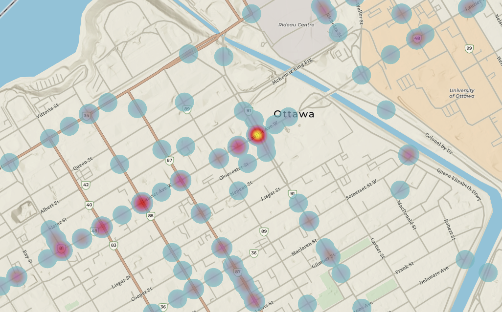
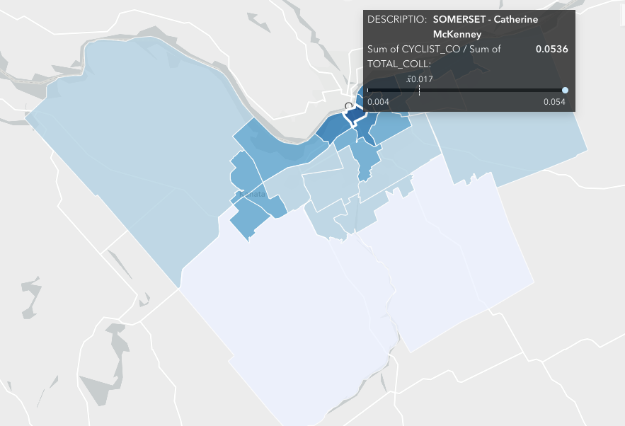
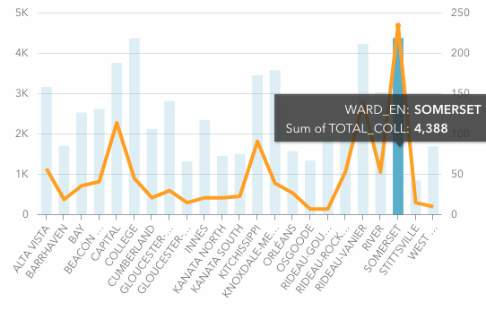
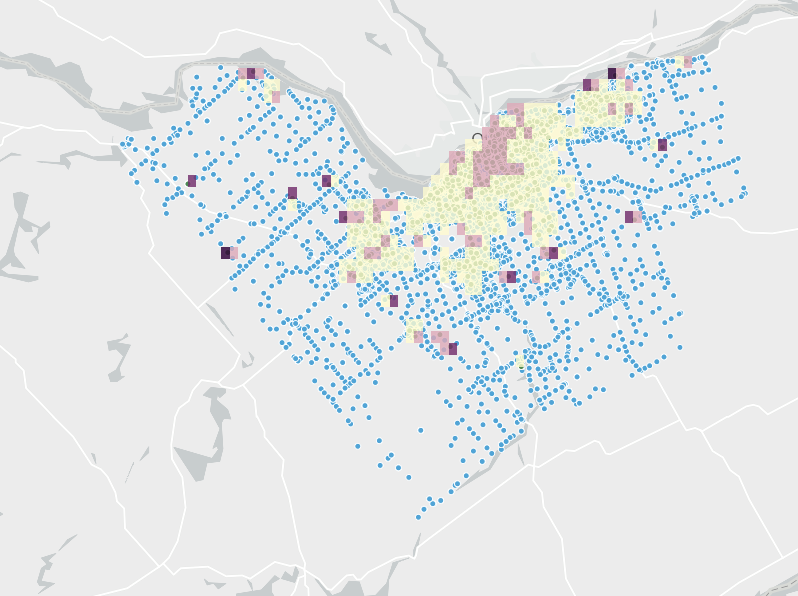

# Cyclist accidents in Ottawa, Canada

<html>

<body>

 
 
 
 

The heatmap shows a concentration of collisions involving cyclists mainly in downtown Ottawa.The image below shows that intersections along Laurier Avenue are prone to collisions involving cyclists. The fact that this is close to the Univeristy of Ottawa may be a factor explaining the high rate of collisions, as students may be using their bikes to get to school. 
 
 
 
 
 
 
 
 
 
 

When divided by Ward, it is interesting to notice that for Somerset ward, 5.36% of all collisions invovle at least one cyclist. This number is significantly higher than the mean across wards (1.7%)
 
 

 
 

In absolute terms (see graph below), this means that there were 4,388 collisions in Somerset from 2015 to 2018, out of which, 235 involved cyclists.
 

 
 

Lastly, in the density map included next shows the density of cycling accidents. We corroborate that, while overall accidents happen all across Ottawa, cycling accidents are pretty concentrated in the central parts of the city.
 
 

 

If scroll down, the interactive version of all previously shown maps and graphs can be accessed
 
 

<iframe src="https://insights.arcgis.com/#/embed/ff26e9bf6d4040178fe486ed306a8078" width="1250" height="2580" frameborder="0"></iframe>

<b>References:</b>

- Materials from “Get Started with ArcGIS Insights | Learn ArcGIS.” Accessed March 30, 2021. https://learn.arcgis.com/en/projects/get-started-with-arcgis-insights/ 

- Created during 90-753 Advanced GIS class, Heinz College, CMU.